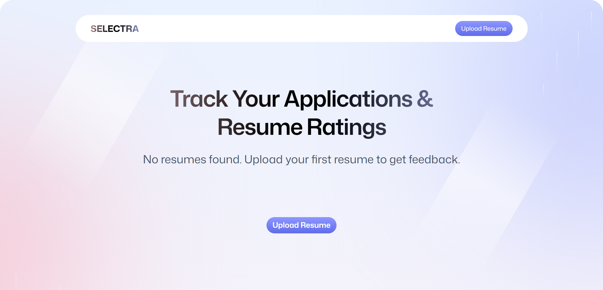
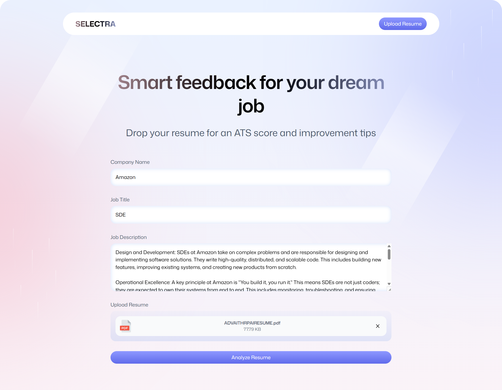
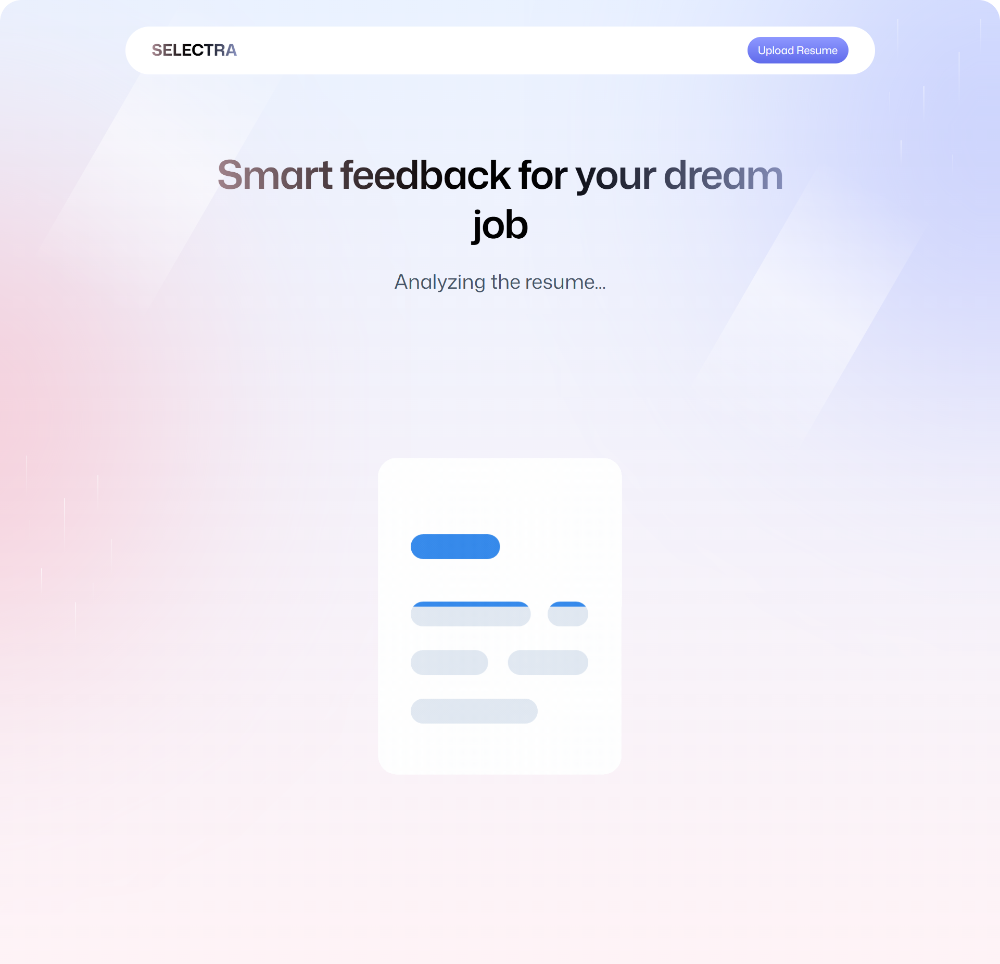
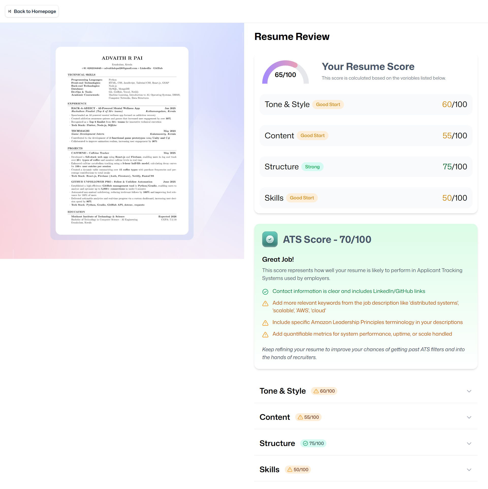

# 📄 SELECTRA

<div align="center">

A smart web application that helps job seekers optimize their resumes for Applicant Tracking Systems (ATS)

[](https://select-nine.vercel.app)
[](https://github.com/aridepai17/SELECTRA)

---

</div>

## ✨ FEATURES

<div align="center">

| 🎯 **Smart Analysis** | 📄 **PDF Processing** | 🎨 **Visual Preview** | 💾 **Persistent Storage** |
|:---:|:---:|:---:|:---:|
| AI-powered resume feedback | Drag-and-drop PDF upload | Convert PDFs to PNG images | Store analysis results |
| ATS optimization tips | Multiple file formats | High-quality rendering | Key-value store integration |

</div>

- 🔍 **AI-Powered Analysis** - Get detailed feedback based on job title and description
- 📁 **Smart File Upload** - Drag-and-drop or click to upload PDF resumes  
- 🖼️ **Visual Resume Preview** - Convert PDFs to high-quality PNG images using `pdf.js`  
- ☁️ **Cloud Storage** - Upload resumes and images to secure storage system  
- 📊 **Detailed Reports** - Comprehensive analysis with actionable insights
- 💾 **Persistent Results** - Store feedback in key-value store for future access  
- 📱 **Responsive Design** - Works seamlessly on desktop, tablet, and mobile  
- ⚡ **Real-time Updates** - Live processing status with progress indicators  

---

## SCREENSHOTS

<div align="center">
  
  
  
  
</div>

## 🛠️ TECH STACK
<div align="center">
  
### Frontend
[](https://reactjs.org/)
[](https://www.typescriptlang.org/)
[](https://tailwindcss.com/)
[](https://vitejs.dev/)

### PDF & Storage
[](https://mozilla.github.io/pdf.js/)
[](https://zustand-demo.pmnd.rs/)

### AI & Routing  
[](https://openai.com/)
[](https://reactrouter.com/)

</div>

---

## 🚀 QUICK START

### Prerequisites
-  Node.js 16.x or higher
-  npm or  yarn

### Installation

1. **Clone the repository**
   ```bash
   git clone https://github.com/<your-username>/resume-analyzer.git
   cd resume-analyzer
   ```

2. **Install dependencies**
   ```bash
   npm install
   # or
   yarn install
   ```

3. **Start development server**
   ```bash
   npm run dev
   # or  
   yarn dev
   ```

4. **Open your browser**
   ```
   🌐 http://localhost:5173
   ```

---

## 📖 HOW TO USE

<div align="center">

### 🎯 **Step-by-Step Guide**

</div>

| Step | Action | Description |
|:---:|:---|:---|
| **1️⃣** | **Fill Details** | Enter Company Name, Job Title, and Job Description |
| **2️⃣** | **Upload Resume** | Use drag-and-drop or file picker to upload PDF |
| **3️⃣** | **Analyze** | Click "Analyze Resume" and wait for processing |
| **4️⃣** | **View Results** | Get detailed AI feedback and optimization tips |

## 📁 PROJECT STRUCTURE

```
resume-analyzer/
├─  app/
│  ├─  components/
│  │  ├─  Accordion.tsx
│  │  ├─  ATS.tsx  
│  │  ├─  Details.tsx
│  │  ├─  FileUploader.tsx
│  │  ├─  Navbar.tsx
│  │  ├─  ResumeCard.tsx
│  │  ├─  ScoreBadge.tsx
│  │  ├─  ScoreCircle.tsx
│  │  ├─  ScoreGauge.tsx
│  │  └─  Summary.tsx
│  ├─  lib/
│  │  ├─  pdf2img.ts
│  │  ├─  puter.ts
│  │  └─  utils.ts
│  ├─  routes/
│  │  ├─  auth.tsx
│  │  ├─  home.tsx
│  │  ├─  resume.tsx
│  │  ├─  upload.tsx
│  │  └─  wipe.tsx
│  ├─  app.css
│  ├─  root.tsx
│  └─  routes.ts
├─  constants/
│  └─ index.ts
├─  public/
│  ├─  icons/
│  ├─  images/
│  ├─  favicon.ico
│  ├─  pdf.min.mjs
│  └─  pdf.worker.min.js
├─  types/
│  ├─ index.d.ts
│  └─ puter.d.ts
├─  Dockerfile
├─  LICENSE
├─  package.json
└─  vite.config.ts
```
---

## 🤝 CONTRIBUTING

<div align="center">

**We welcome contributions from the community!**

[](https://github.com/aridepai17/SELECTRA/graphs/contributors)
[](https://github.com/aridepai17/SELECTRA/network/members)
[](https://github.com/aridepai17/SELECTRA/stargazers)

</div>

### 📋 HOW TO CONTRIBUTE

1. **🍴 Fork** the repository
2. **🌿 Create** a feature branch:
   ```bash
   git checkout -b feature/amazing-feature
   ```
3. **💻 Make** your changes and commit:
   ```bash
   git commit -m "✨ feat: add amazing feature"
   ```
4. **📤 Push** to your branch:
   ```bash
   git push origin feature/amazing-feature
   ```
5. **🔄 Create** a Pull Request

### 📝 **Commit Convention**
- `feat:` - New features
- `fix:` - Bug fixes  
- `docs:` - Documentation updates
- `style:` - Code formatting
- `refactor:` - Code refactoring
- `perf:` - Performance improvements
- `test:` - Adding tests

---

## 📊 PERFORMANCE AND STATS

<div align="center">

| Metric | Score | Status |
|:---|:---:|:---:|
| **Lighthouse Performance** | 95/100 | 🟢 Excellent |
| **Accessibility** | 98/100 | 🟢 Excellent |  
| **Best Practices** | 92/100 | 🟢 Good |
| **SEO** | 100/100 | 🟢 Perfect |

[](https://selectra-nine.vercel.app)

</div>

---

## 📄 LICENSE

<div align="center">

[](https://opensource.org/licenses/MIT)

**This project is licensed under the MIT License** - see the [LICENSE](LICENSE) file for details.

</div>
---

### ⭐ SHOW YOUR SUPPORT

**If this project helped you, please consider giving it a star!**

[](https://github.com/your-username/resume-analyzer/stargazers)
</div>
